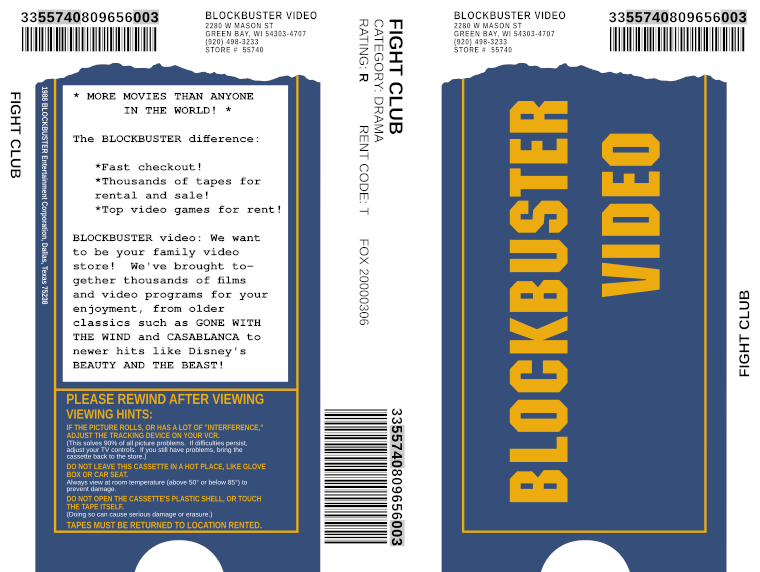

# Blockbuster Video VHS insert template

This is an editable Inkscape template for a Blockbuster Video VHS clamshell case insert.  Please note that this doesn't strive to be 100% accurate to any specific Blockbuster design, as they made incremental design changes to their clamshells over the years.  Instead, it's meant to be a good enough period piece of late 80s through 90s.

## Notes

The fields you'd want to change are all in Liberation Sans and Liberation Sans Narrow fonts, but if you don't have them, similar sans-serif fonts should work fine.

The back blurb area is Nimbus Mono PS font, but again, any typewriter-like monospace font should be fine. I've also seen "The BLOCKBUSTER difference" blurb in a sans-serif font.  Later on in the 90s, this space tended to be used for actual movie information, in a sans-serif font.

The "BLOCKBUSTER VIDEO" logo font is ITC Machine Std and the barcode is Libre Barcode 128. I've broken these out to separate layers which have alternate layers which are "pre-rendered", so you do not need the fonts.

An additional set of layers are available for the simpler "BLOCKBUSTER" logo used later.

The barcode format changed several times over the years, but the format depicted here is:

* 33: Rental. There were likely other codes for things like services, goods, etc.
* 55740: The 5-digit store number.
* 809656: A title-specific internal Blockbuster ID.
* 003: The per-title sequence for the store. For example, if the store had 10 copies of a title, they would be 001 through 010.

I don't know what "Rent Code" is, but I've seen "B", "N" and "T".

"FOX 2000306" is the studio-specific catalog number for a title (in this case, for Fight Club).

The title area may just have the title, but it could also have extra information listed. A common alternative format would be "FIGHT CLUB-1999-BRAD PITT".  Sometimes it would also show "NEW RELEASE-FIGHT CLUB".

The most minor variation, but I've seen the rating ("R" in this example) sometimes be bolded, sometimes not.

For a list of addresses and store numbers as of Blockbuster's bankruptcy, see [this bankruptcy filing from 2010](https://www.wsj.com/public/resources/documents/BlockbusterCh11.pdf). Finding the phone number from the store will take some additional searching.

A hidden layer outlines where the spine is in relation to the elements, for alignment purposes. Notice that the spine's barcode actually wraps around to the back a little, by design.

For an authentic Blockbuster case experience, take the "Barcodes" and "Fillable text" layers, group them all together, and shift them by a random amount relative to the base design, before printing.

Blockbuster also used VHS clamshells for SNES and Genesis cartridge distribution.  In these cases, the category is "GAMES SNES" or "GAMES GENESIS", rating "N/A". The title will likely have "SNES-" or "GENESIS-" prefixing the actual game title.

## Author

Reproduction created by [Ryan Finnie](https://www.finnie.org/). I'm not sure about the legal standing of a design semi-reproduction of a defunct company, but this template is licensed CC-BY-SA 4.0 International, to the extent it can be licensed.

By the way, the location depicted on the template in Green Bay is a location I have pleasant memories of, having competed in the Blockbuster World Video Game Championships II competition in 1995, playing on the [Donkey Kong Country Competition Cartridge](https://www.mariowiki.com/Donkey_Kong_Country_Competition_Cartridge). I finished second place in the Nintendo division for that store.
